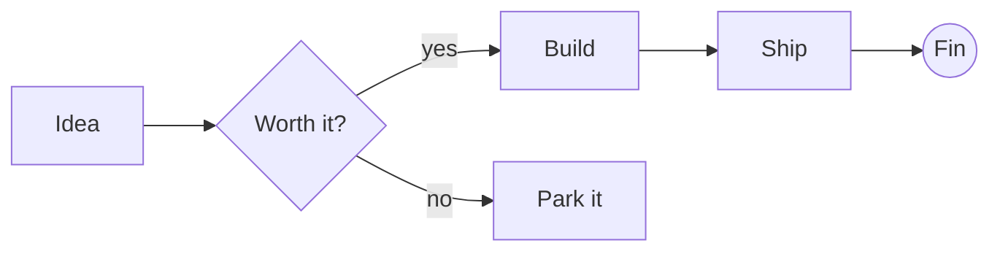
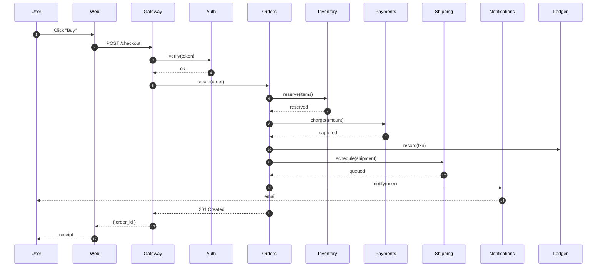
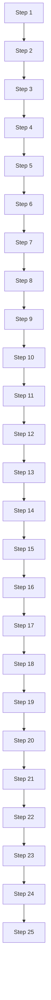

# Diagrams That Must Fit

A small flowchart first, then a deliberately oversized sequence diagram so we can prove fit-to-page works.

## Small flowchart

## Wide sequence diagram

This one is intentionally wide — many actors, many round-trips. It must not overflow horizontally.

## Tall flowchart

This one is intentionally tall — many vertical levels — to confirm we also clip vertically.

